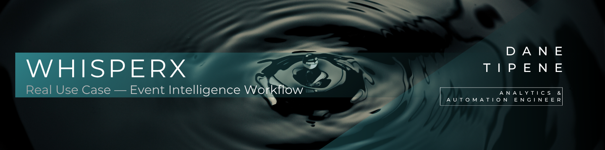
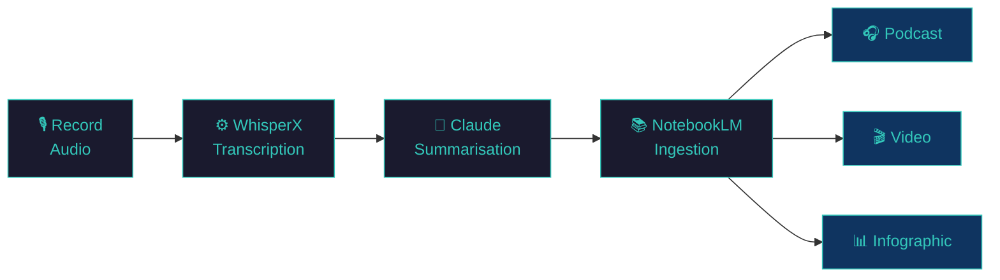

<br>

## Table of Contents

- [Overview](#overview)
- [The Workflow](#the-workflow)
- [Tools Used](#tools-used)
- [The Prompt](#the-prompt)
- [Outputs](#outputs)

---

<br>

## Overview

Attending a seminar is easy. Retaining what you learned is not.

Notes taken in the moment are incomplete. Raw audio sits on your phone and never gets revisited. The insight fades within days. This is the problem with most professional learning events — the value is front-loaded into the room and rarely extracted afterward.

**I built a lightweight intelligence workflow that turns a single audio recording into a structured, multi-format knowledge asset:**

- Transcribes the full recording with speaker identification — no manual note-taking required
- Produces a structured summary grouped by speaker and topic — ready for deep review
- Generates a two-person podcast and video presentation for repeated, passive review
- Creates an infographic for quick reference

The result: a 1 hour 56 minute seminar became a searchable, reviewable knowledge asset in multiple formats — built entirely from one audio file recorded on a phone.

---

<br>

## The Workflow

**Event:** Google Cloud Agentic AI Seminar  
**Date:** 5 March 2026, 0800–1100  
**Location:** Google Office, Australia  
**Format:** MC (Beth) + 5 speakers  
**Duration:** ~1 hour 56 minutes (first hour breakfast and networking, hours 2–3 the seminar itself)  



**Step 1 — Record**  
Audio recorded on a phone during the seminar. No specialist equipment required.

**Step 2 — Transcribe**  
Audio processed through the WhisperX GPU pipeline — speaker-labelled, timestamped output in TXT and CSV format. A ~2 hour recording processed in a fraction of real time.

**Step 3 — Summarise**  
The CSV transcript fed into Claude with a structured prompt. Output: a detailed, section-based summary grouped by speaker and topic — accurate enough to feed into NotebookLM without hallucinations.

**Step 4 — Ingest**  
The Claude summary uploaded to NotebookLM as the sole source document.

**Step 5 — Generate**  
NotebookLM generates three outputs from the same source:
- A two-person AI podcast for passive listening review
- A video presentation walkthrough
- An infographic for quick reference

---

<br>

## Tools Used

| Tool | Role | Why |
|---|---|---|
| Phone voice recorder | Audio capture | Available, private, no setup required |
| WhisperX (GPU build) | Transcription + speaker diarisation | Local, private, accurate, fast |
| Claude | Structured summarisation | Handles long transcripts, prompt-controllable output structure |
| NotebookLM | Learning material generation | Converts structured text into podcast, video, and infographic |

**Why not transcribe directly in NotebookLM?**  
NotebookLM accepts audio uploads and transcribes them automatically — but it does not perform speaker diarisation. It cannot tell you who said what. Routing through WhisperX first produces speaker-labelled output, which gives Claude (and therefore NotebookLM) the context it needs to structure content accurately by presenter.

**Why summarise with Claude before NotebookLM?**  
Feeding a raw 2-hour transcript directly into NotebookLM risks hallucination and loss of structure. The Claude summary step compresses and structures the content first — giving NotebookLM a clean, well-organised source document that maps directly to the seminar's actual flow.

---

<br>

## The Prompt

The following prompt was used to generate the structured summary from the WhisperX CSV output:

```
You are a seminar transcription analyst. Create detailed, section-based summaries
from recorded seminar transcripts to feed into NotebookLM for video walkthroughs
and podcasts.

INPUT FORMAT
CSV file with columns: Start time, End time, Speaker, Text

CRITICAL CONSTRAINT
Speaker labels are only ~60% accurate. Do NOT trust them blindly. Use content
analysis, topic shifts, and contextual clues to identify true speaker boundaries.

YOUR TASK
1. Read the full transcription to understand flow and structure
2. Identify natural sections:
   - MC opening
   - Speaker 1 presentation
   - MC transition
   - Speaker 2 presentation
   - (Continue pattern for all speakers)
3. Group content by actual presentation sections (ignore inaccurate speaker labels)
4. Create detailed summaries for each section

SUMMARY REQUIREMENTS
- Detailed enough for NotebookLM to generate accurate content (no hallucinations)
- Preserve key points, examples, and technical details
- Note topic transitions and context
- Label each section clearly (MC Intro, Speaker 1, etc.)

DETECTION STRATEGY
Look for:
- Topic/subject matter shifts
- Presentation style changes
- Introductions ("Next we have...")
- Closing remarks/thank yous
- Question transitions

CONTEXT
Seminar topic: Google Cloud Agents
Format: MC + 5 speakers with transitions between each
```

> **Why this prompt works:** The critical constraint acknowledging ~60% speaker label accuracy is key. WhisperX speaker diarisation is highly accurate for clean audio but can misattribute labels in crowded rooms with ambient noise and multiple speakers. Instructing Claude to use content analysis rather than speaker labels produces a structurally accurate summary regardless of diarisation imperfections.

---

<br>

## Outputs

All outputs below were generated from a single phone recording of the Google Cloud Agentic AI Seminar.

| Output | Format | Generated By |
|---|---|---|
| Original recording | M4A | Phone voice recorder |
| Speaker-labelled transcript | TXT | WhisperX GPU pipeline |
| Timestamped transcript | CSV | WhisperX GPU pipeline |
| Structured summary | MD | Claude |
| Podcast | M4A | NotebookLM |
| Video presentation | MP4 | NotebookLM |
| Infographic | PNG | NotebookLM |

Original recording and transcriptions are stored in [`03_Transcribe_Audio/Google Cloud Agentic AI`](../03_Transcribe_Audio/Google%20Cloud%20Agentic%20AI)  
Remaining documents are stored in [`04_Documents`](../04_Documents/Google%20Agentic%20AI%20Seminar)

---

<br>

*Built by [Dane Tipene](https://github.com/ESC-DataDaneHQ) · Analytics & Automation Engineer*
