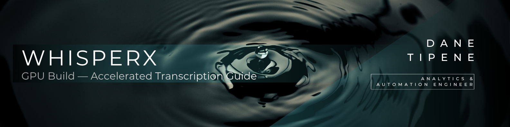

<br>

## Overview

This is the GPU-accelerated version of the WhisperX transcription pipeline. If you have an NVIDIA GPU, this build will process audio significantly faster than the CPU build — tested at 10.4x faster on an NVIDIA RTX 3060 Laptop.

**Prerequisite:** The [Standard Build](./SOP_WhisperX_Standard_Build.md) must be working before setting up GPU acceleration. This guide assumes you have already completed that setup.

**Why a separate build?** RStudio's Python bridge (Reticulate) becomes unstable when managing large GPU memory objects on Windows, causing R session crashes. The GPU pipeline bypasses this by calling Python directly as a standalone process via R's `system()` function — RStudio acts as a configuration panel and launcher, while Python handles all the heavy lifting independently.

The same browser-based gadget UI from the standard build is used here — the experience is identical, just significantly faster.

---

<br>

## Table of Contents

- [Prerequisites](#prerequisites)
- [Architecture](#architecture)
- [Setup](#setup)
- [How to Run](#how-to-run)
- [Performance Benchmarks](#performance-benchmarks)
- [Troubleshooting](#troubleshooting)

---

<br>

## Prerequisites

Before starting:
- [ ] Standard build working — [SOP WhisperX Standard Build](./SOP_WhisperX_Standard_Build.md)
- [ ] NVIDIA GPU with CUDA support (tested on RTX 3060 Laptop, 6GB VRAM)
- [ ] NVIDIA driver version 525 or later (CUDA 12.x compatible)
- [ ] Estimated additional disk space: 1–2GB (GPU environment)
- [ ] Internet connection for initial setup

**Estimated setup time:** 30–45 minutes (mostly downloads)

> [!NOTE]
> The GPU pipeline has been tested on an NVIDIA GeForce RTX 3060 Laptop GPU (6GB VRAM). GPUs with less than 6GB VRAM may experience memory issues. The pipeline uses `batch_size=1` and `chunk_size=15` to minimise VRAM usage.

---

<br>

## Architecture

The GPU pipeline runs across three scripts:

| Script | Purpose |
|---|---|
| `07_setup_whisperx_gpu.R` | One-time environment setup — run once per machine |
| `08_transcribe_gpu.R` | Configuration launcher — opens the gadget UI and triggers transcription |
| `09_transcribe_gpu.py` | Standalone Python worker — called automatically by the R script, do not edit |

**How it works:** `08_transcribe_gpu.R` opens the same browser-based gadget UI from the standard build, reads your configuration, then calls `09_transcribe_gpu.py` directly via R's `system()` function. Python runs as a completely separate process with no shared memory between R and Python. Results are written directly to a `Completed` subfolder alongside your audio file.

---

<br>

## Setup

1. Open `07_setup_whisperx_gpu.R` in RStudio
2. Click anywhere inside the script and press `Ctrl + Shift + Enter` to run it

> [!IMPORTANT]
> Use `Ctrl+Shift+Enter` (Run), not `Ctrl+Shift+S` (Source). Source will skip the Hugging Face token prompt and setup will fail at model download.

> [!NOTE]
> This script may take 30–45 minutes depending on your internet connection. This is normal — do not close RStudio or interrupt the script while it is running.

The setup script will:
- Create the `whisperx-gpu` conda environment (Python 3.10)
- Install CUDA-enabled PyTorch 2.5.1
- Install cuDNN 8 (required by ctranslate2)
- Verify your GPU is visible to PyTorch
- Install WhisperX and pyannote-audio
- Install all runtime dependencies
- Patch pyannote for huggingface_hub compatibility
- Prompt for your Hugging Face token and download all required models

After the script completes successfully, you are ready to run the GPU transcription script.

---

<br>

## How to Run

1. Open `08_transcribe_gpu.R` in RStudio
2. Click anywhere inside the script and press `Ctrl + Shift + Enter` to run it
3. A browser window will open automatically titled **WhisperX Transcription — Run Configuration**. You only need to adjust three settings:
   - **Audio File or Folder:** enter the path to your audio file or folder using forward slashes — e.g. `02_Audio/JFK_Test/01_jfk.flac` for a single file, or `02_Audio/JFK_Test` for a folder
   - **Hugging Face Token:** paste your saved Hugging Face token into the text box
   - **Offline Mode:** on your first run, make sure this box is **unchecked**. All subsequent runs will default to Offline mode

   All other settings are pre-configured — leave them as they are.

4. Scroll down and select **Confirm & Run**

> [!IMPORTANT]
> - ⚠️ Do not close RStudio while the script is running.
> - Unlike the CPU build, the GPU pipeline processes audio as a separate Python process. You will see console output from Python appearing in the RStudio terminal rather than the console pane — this is expected behaviour.

**What happens next:**
- If a single file is entered, that file is transcribed only
- If a folder is entered, the script recursively searches through all subfolders for audio files (`.mp4`, `.flac`, `.mp3`, `.wav`, `.m4a`) and transcribes each one sequentially
- Already transcribed files are automatically skipped on subsequent runs
- Transcription outputs are saved to a `Completed` subfolder alongside the original audio file

---

<br>

## Performance Benchmarks

Testing was conducted on an NVIDIA GeForce RTX 3060 Laptop GPU (6GB VRAM) using a 4:34 minute two-speaker test recording — the same recording used for CPU benchmarking.

**large-v3 model (offline)**

| Step | GPU | CPU | Speedup |
|---|---|---|---|
| Step 1: Load model and audio | 0:06.9 | 0:17.0 | 2.5× |
| Step 2: Transcribe | 0:25.3 | 4:19.7 | 10.3× |
| Step 3: Align timestamps | 0:03.2 | 0:26.3 | 8.2× |
| Step 4: Identify speakers | 0:12.0 | 3:09.4 | 15.8× |
| **Total** | **0:47.4** | **8:12.4** | **10.4×** |

**Processing rate:** ~5.8× faster than real-time (GPU) vs ~1.75× slower than real-time (CPU)

**Transcription accuracy:** 99.98% — consistent with CPU pipeline results.
- Speaker identification was largely accurate with one instance where a sentence spoken across two speakers was attributed entirely to one speaker
- Minor filler words (e.g. "oh", "yep") were filtered out, consistent with CPU pipeline behaviour

---

<br>

## Troubleshooting

For general errors — path issues, audio not found, output save failures, and Hugging Face connectivity — refer to the [Standard Build troubleshooting guide](./SOP_WhisperX_Standard_Build.md#troubleshooting).

**GPU-specific errors:**

**Error: "Could not locate cudnn_ops_infer64_8.dll"**
- cuDNN 8 is not installed or not on the PATH
- Run: `conda install -c conda-forge cudnn=8` in Command Prompt with the `whisperx-gpu` environment activated
- If the error persists, the DLL exists but isn't being found — the R script handles this via PATH injection automatically

**Error: "TypeError: hf_hub_download() got an unexpected keyword argument 'use_auth_token'"**
- pyannote uses a deprecated huggingface_hub argument
- Re-run `07_setup_whisperx_gpu.R` — the setup script patches this automatically

**Error: "TypeError: Pipeline.from_pretrained() got an unexpected keyword argument 'token'"**
- The pyannote patch went too far and changed internal function calls that should not have been changed
- Re-run `07_setup_whisperx_gpu.R` to reapply the correct patch

**Error: "RuntimeError: Could not locate nvrtc-builtins64_121.dll"**
- CUDA runtime compilation library not found
- Run: `conda install -c nvidia cuda-nvrtc` in the `whisperx-gpu` environment

**Error: R session crashes during transcription**
- Ensure you are using `08_transcribe_gpu.R` and not the CPU script
- The GPU pipeline must call Python via `system()` — using Reticulate for GPU workloads on Windows causes R session crashes

**GPU not detected — `torch.cuda.is_available()` returns False**
- Verify NVIDIA drivers are installed: open Device Manager → Display Adapters
- Ensure PyTorch was installed via conda with `pytorch-cuda=12.1` — a pip-only install will not include CUDA support
- Re-run `07_setup_whisperx_gpu.R` from scratch if unsure

**Error: "httpx.LocalProtocolError: Illegal header value b'Bearer '"**
- Your Hugging Face token is empty or was not captured correctly by the `readline()` prompt
- Set it manually in the RStudio Console before re-running Stage 10:
```r
  hf_token <- "hf_your_actual_token_here"
```
- Then re-run the Stage 10 `py_run_string` block only — do not rerun the full script

**Reticulate using wrong Python environment (Python 3.12 instead of 3.10)**
- Newer versions of reticulate manage their own Python via `uv`, overriding your conda environment
- Restart your R session (`Ctrl + Shift + F10`) and run these two lines before anything else:
```r
  library(reticulate)
  reticulate::use_condaenv("whisperx-gpu", required = TRUE)
```
- Confirm it worked with `reticulate::py_config()` — you should see Python 3.10 from `r-miniconda/envs/whisperx-gpu`

**Error: "ImportError: Lazy import of LazyModule...speechbrain.integrations.k2_fsa failed"**
- speechbrain version incompatibility with the k2_fsa integration
- In the RStudio Terminal with `whisperx-gpu` activated, run:
```r
pip install speechbrain==0.5.16
```
- Then restart your R session, force the conda environment, set your token, and re-run the Stage 10 model download block only

---

<br>
