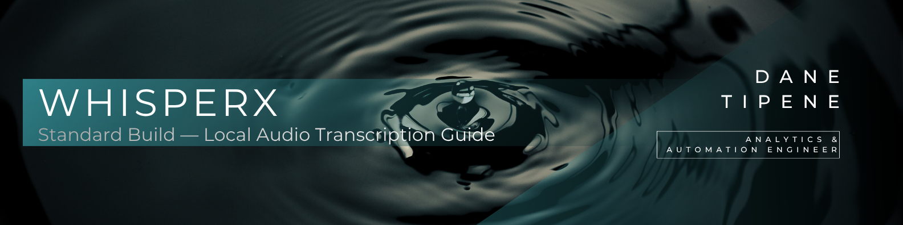

<br>

## Overview

This pipeline was originally built to transcribe 3,478 sensitive enforcement call recordings across 300 customers — locally, offline, and without any audio leaving the team's infrastructure. The full workplace build and the design decisions behind it are documented in the repository [README](../README.md).

This guide covers the standard build — a portable version of the same pipeline that runs on your own machine for any transcription need where privacy and reliability matter. No SharePoint, no cloud services, no audio sent to third parties.

**What you'll have by the end of this guide:**

- A fully configured local transcription environment  
- The ability to transcribe single files or entire folders of audio in one run  
- Speaker-labelled output in your choice of TXT, CSV, SRT, or JSON  
- A pipeline that runs completely offline after initial setup  

**Estimated setup time**: 30–40 minutes (one time only)

---

<br>

## Contents

- [What Gets Installed](#what-gets-installed)
- [Prerequisites](#prerequisites)  
- [Fork/Clone Repository](#forkclone-repository) 
- [Configure Hugging Face Access](#configure-hugging-face-access-one-time)
- [Install FFmpeg](#install-ffmpeg-one-time)
- [Setup](#setup)
- [How to Run](#how-to-run)
- [Syncing Your Fork](#syncing-your-fork)
- [Troubleshooting](#troubleshooting)

---

<br>

## What Gets Installed

Nine core items will be installed:

- **Reticulate** — R package that bridges R and Python, and triggers the rest of the installation automatically
- **Miniconda** — Python environment manager, installed automatically by Reticulate. Creates an isolated space for all Python components to run without affecting anything else on your machine
- **PyTorch** — the engine that powers the AI models. Think of it as the calculator the models use to do their work
- **WhisperX** — the core transcription tool, built on OpenAI's Whisper model and optimised for speed and accuracy
- **Faster-Whisper** — the optimised transcription engine inside WhisperX that converts speech to text
- **Pyannote Models** — three AI models responsible for identifying and separating speakers in a recording
- **FFmpeg** — audio processing tool that prepares recordings before the AI models can work on them

---

<br>

## Prerequisites

Before starting:
- [ ] RStudio installed and working
- [ ] Internet connection available (for initial setup)
- [ ] Estimated disk space: 5-7GB (includes Python environment, WhisperX, PyTorch, and pyannote models)  
- [ ] Repository cloned to your machine [(see instructions)](#forkclone-repository)  
- [ ] Hugging Face account and token [(see instructions)](#configure-hugging-face-access-one-time)
- [ ] FFmpeg installed [(see instructions)](#install-ffmpeg-one-time)

**Estimated total time:** 30-40 minutes

---

<br>

## Fork/Clone Repository

**Step 1: Fork the Repository**

1. Go to the main [`page`](https://github.com/DataDaneHQ/whisperx-transcription-pipeline) GitHub repository page 
2. Click the **Fork** button in the top-right corner
3. Ensure the **Owner** is you, the **Repository name** is available, click **Create fork**
4. GitHub will create a copy under your account
5. You'll be redirected to your forked repository — the URL will show your username

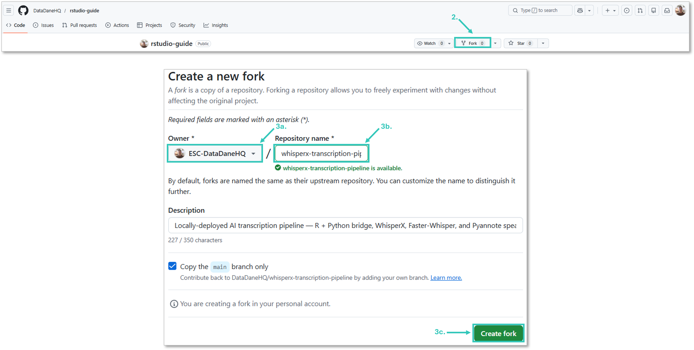

<br>

**Step 2: Get Your Repository URL**

1. Navigate to your forked repository page on GitHub
2. Click the green **Code** button
3. Ensure **HTTPS** is selected (not SSH)
4. Click the copy icon to copy the URL — it will look like:
   `https://github.com/YOUR-USERNAME/repo-name.git`

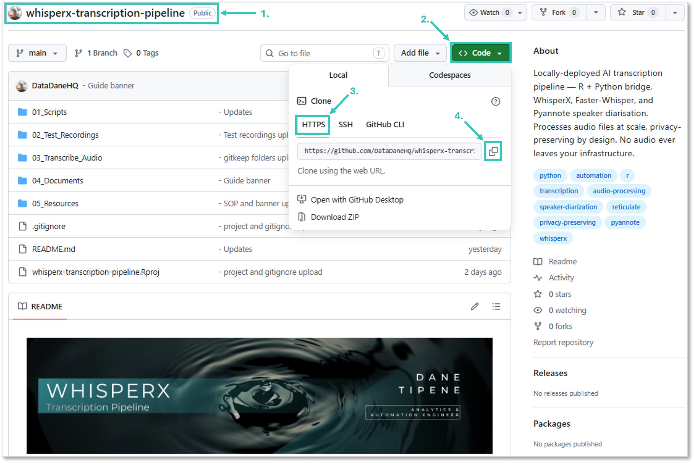

<br>

**Step 3: Link to RStudio**

1. Open RStudio
2. Go to **File → New Project → Version Control → Git**
3. Paste your URL into the **Repository URL** field
4. Choose where to save the project on your computer (e.g. Documents)
5. Click **Create Project**
6. RStudio will download the repository and open it as a project automatically

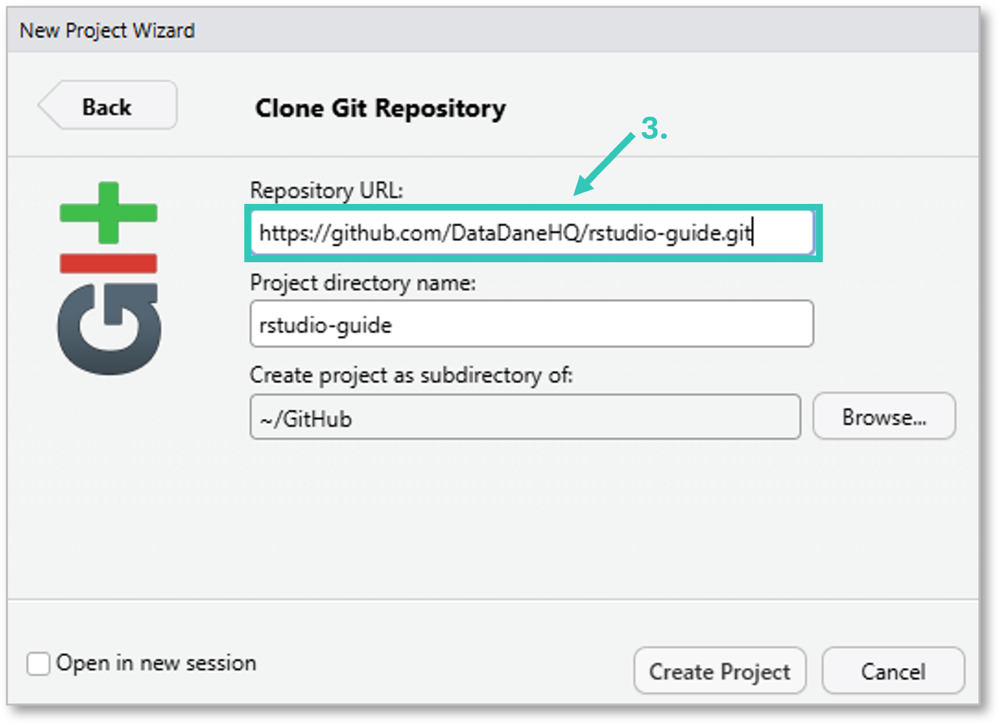

---

<br>

## Configure Hugging Face Access (one time)

WhisperX uses pyannote models for speaker identification. These must be downloaded from Hugging Face, which requires a free account, acceptance of model terms, and an access token.

**Step 1: Create Hugging Face Account**
1. Go to https://huggingface.co/join
2. Sign up with your email address
3. Verify your email

**Step 2: Accept Model Terms**
1. Visit https://huggingface.co/pyannote/speaker-diarization-3.1 → Click "Agree and access repository"
2. Visit https://huggingface.co/pyannote/segmentation-3.0 → Click "Agree and access repository"
3. Visit https://huggingface.co/pyannote/speaker-diarization-community-1 → Click "Agree and access repository"

> [!NOTE] 
> Before you can click "Agree and access repository", Hugging Face will ask you to provide your website URL and organisation name. Enter your personal or organisation website and name. This is a standard verification step required by the model's licence terms.

> [!IMPORTANT]
> After accepting the model terms, wait a few minutes before generating your access token. There is a short delay between accepting terms and Hugging Face fully granting your account access. Generating the token too quickly may result in a token without the necessary model permissions, causing authentication errors later in the setup process. While you wait, you can install FFmpeg then come back to step 3.

**Step 3: Generate Access Token**
1. Go to https://huggingface.co/settings/tokens
2. Click "New token"
3. Name it: `whisperx-token`
4. Token type: Select "Read"
5. Click "Generate token"
6. Copy the token immediately — it looks like: `hf_xxxxxxxxxxxxxxxxxxxxxxxxxxxxxx`

**Step 4: Store Token Securely**
1. Save your token somewhere accessible on your computer — you'll need it during setup
2. Example location: `C:\Users\YourName\Documents\hf_token.txt`

---

<br>

## Install FFmpeg (one time)

WhisperX uses FFmpeg to process audio files efficiently.

**Windows:**

1. **Download:** https://www.gyan.dev/ffmpeg/builds/ffmpeg-release-essentials.zip
2. **Extract:**
   - Right-click the downloaded zip file
   - Click "Extract All"
   - **Change the destination path to:** `C:\ffmpeg`
   - Click "Extract"
   - **Important:** Open `C:\ffmpeg` and move everything from the versioned subfolder (e.g. `ffmpeg-8.0.1-essentials_build`) directly into `C:\ffmpeg`, then delete the empty subfolder
   - **Final structure should be:** `C:\ffmpeg\bin\ffmpeg.exe`
3. **Add to PATH:**
   - Press Windows key
   - Type "environment"
   - Click "Edit environment variables for your account" (NOT "Edit the system...")
   - In the window that opens, find "Path" in the top box (User variables)
   - Double-click "Path"
   - Click "New"
   - Type: `C:\ffmpeg\bin`
   - Click "OK" twice  

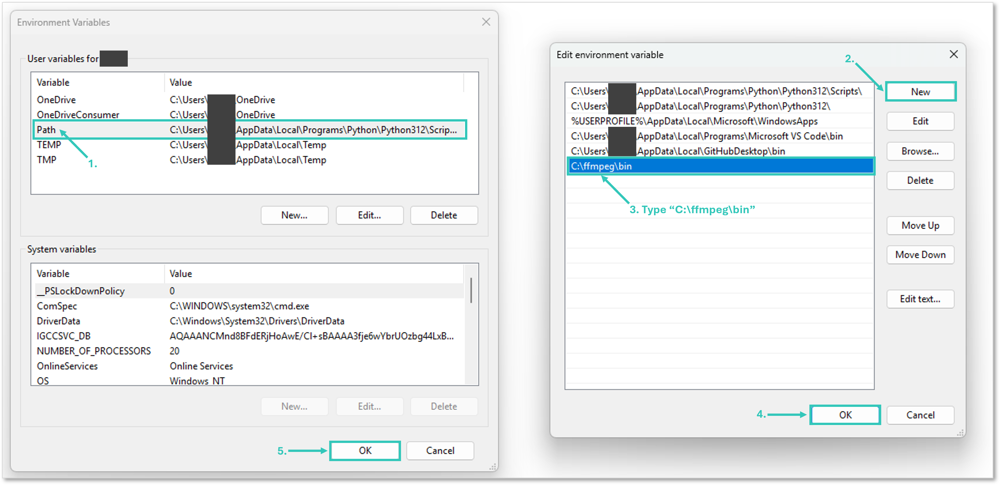  

4. **Restart RStudio** if currently open (File → Quit Session...)  
5. **Verify:** Run `ffmpeg -version` in RStudio Terminal

---

<br>

## Setup

1. Open your `whisperx-transcription-pipeline` project in Rstudio  
2. Open `01_setup_whisperx.R` in RStudio
3. Click anywhere inside the script and Press `ctrl + shift + enter` to run it

> [!IMPORTANT]
> Use `Ctrl+Shift+Enter` (Run), not `Ctrl+Shift+S` (Source). Source will skip the Hugging Face token prompt and the setup will fail at model download.
> When the script reaches Stage 6, watch the console — it will prompt you to enter your Hugging Face token.

> [!NOTE]
> This script may take >20 minutes to complete depending on your internet connection and laptop specs. This is normal — do not close RStudio or interrupt the script. If the console appears inactive for an extended period, check that either the red stop button or green interrupt button is still showing in the top right corner of the Console window — if it is, the script is still running.

The script will:
- Install reticulate
- Install Miniconda
- Create the `whisperx` conda environment (Python 3.10)
- Install WhisperX and all dependencies
- Prompt for your Hugging Face token
- Download and cache all required models (pyannote speaker diarisation, WhisperX large-v3, English alignment model)

After the script completes successfully, you are ready to run the transcription script.

---

<br>

## How to Run

This version is designed for transcription of audio files stored locally within your project folder. After first-time setup, it runs fully offline.

1. Open the standard transcription script: `01_Scripts` → `04_transcribe_standard_ui_build.R`
2. Click anywhere inside the script and press `ctrl + shift + enter` to run it
3. A browser window will open automatically titled **WhisperX Transcription — Run Configuration**. You only need to adjust three settings:
   - **Audio File or Folder:** enter the path to your audio file or folder, separated by forward slashes — e.g. `02_Test-Recordings/JFK_Test/01_jfk.flac` for a single file, or `02_Test-Recordings/JFK_Test` for a folder
   - **Hugging Face Token:** paste your saved Hugging Face token into the text box
   - **Offline Mode:** on your first run, make sure this box is **unchecked**. All subsequent runs will default to Offline mode

   All other settings are pre-configured — leave them as they are.

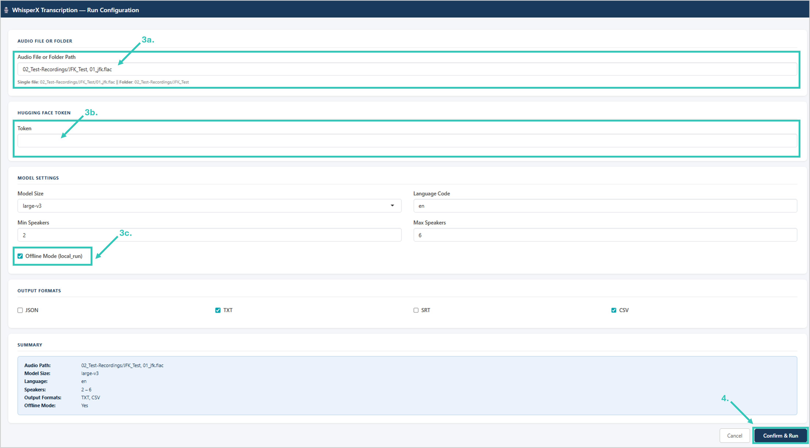  

4. Scroll down and select "Confirm & Run"

> [!IMPORTANT]
> - ⚠️ Do not close RStudio while the script is running.
> - Check your laptop will not automatically turn off during any overnight runs. Go to Windows Settings → System → Power & Battery → Screen, sleep, & hibernate timeouts → Make my device sleep after → Never.

**What happens next:**
- If a single file is entered, that file is transcribed only
- If a folder is entered, the script recursively searches through all subfolders for audio files (`.mp4`, `.flac`, `.mp3`, `.wav`, `.m4a`) and transcribes each one sequentially
- Already transcribed files are automatically skipped on subsequent runs
- Transcription outputs are saved to a `Completed` subfolder alongside the original audio file within your project folder

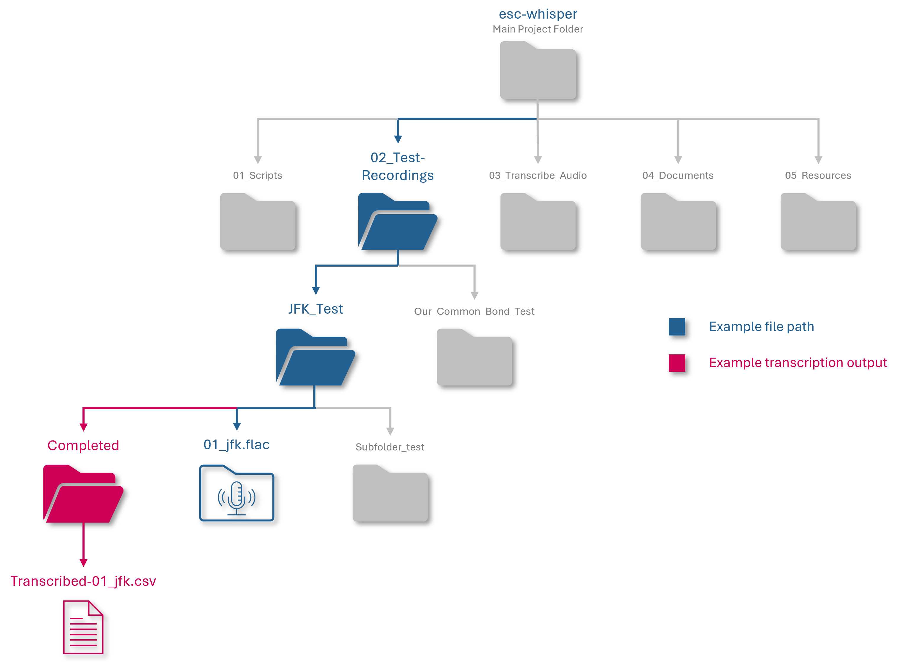  

<details>
<summary>Advanced Options - Click to expand</summary>
<br style="line-height:0.5;">  

**Model Settings**

- **Model Size** — seven options from tiny to large-v3-turbo. Larger models are more accurate but slower. Leave set to the default large-v3 unless advised otherwise.
- **Language Code** — set to `en` for English. Set to `NULL` to auto-detect — useful for mixed-language recordings but slightly slower.
- **Min/Max Speakers** — set the expected number of speakers in the recording. Tighter bounds improve speaker identification accuracy.

**Output Formats**

- **JSON:** full data export
- **TXT:** Human-readable transcript
- **SRT:** Subtitle format for video
- **CSV:** Spreadsheet format

</details> 

---

<br>

## Syncing Your Fork

From time to time scripts and documentation may be updated. To ensure you're always working with the latest versions, sync your forked repository then pull the changes into your local project folder.

1. Open your forked repository on GitHub and click **Sync fork** to retrieve the latest updates from the original repository.

   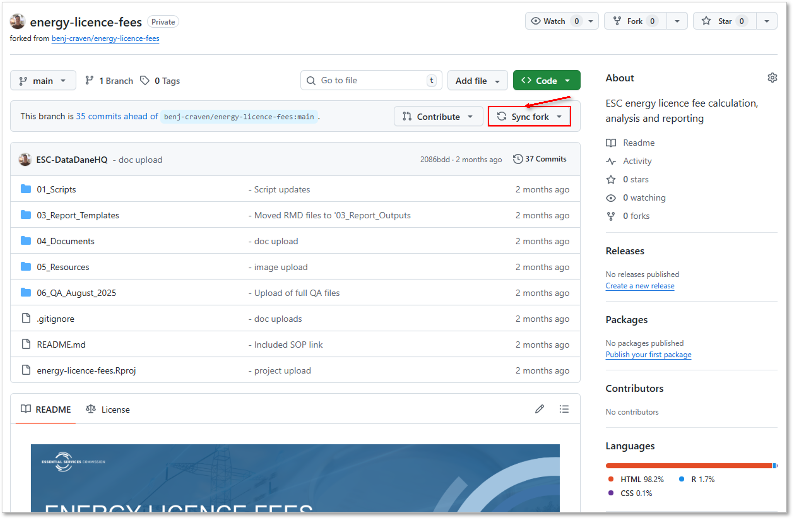

2. Open your forked `whisperx-transcription-pipeline` project in RStudio.

3. Close all currently open scripts.

   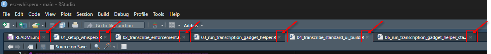

4. Open the **Git** tab in the top right pane and click **Pull** — or the down arrow if the pane is too narrow to display the full label.

   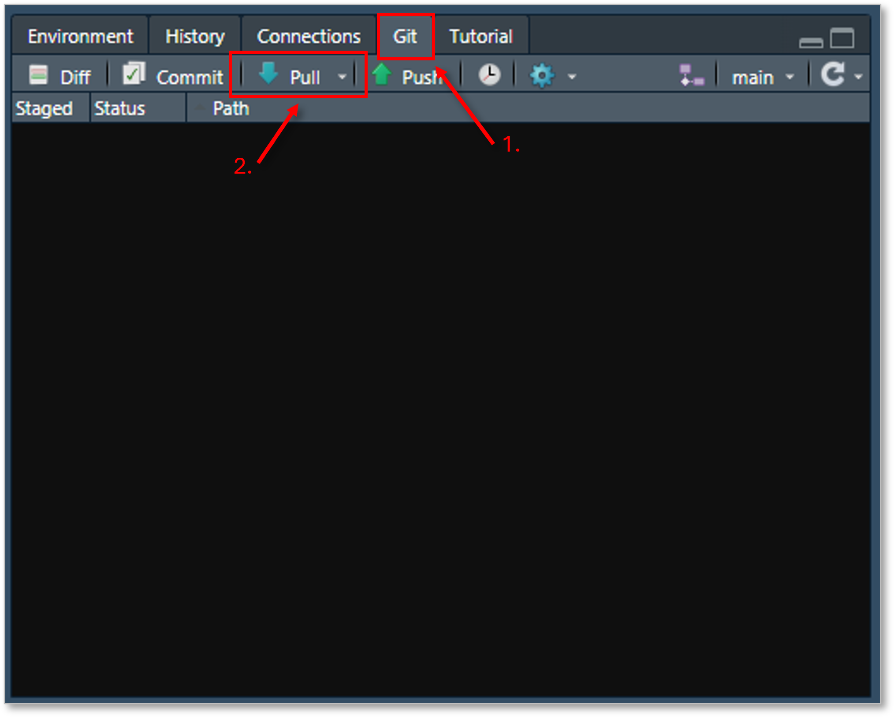

5. Reopen your scripts — your repository and project files are now up to date.

   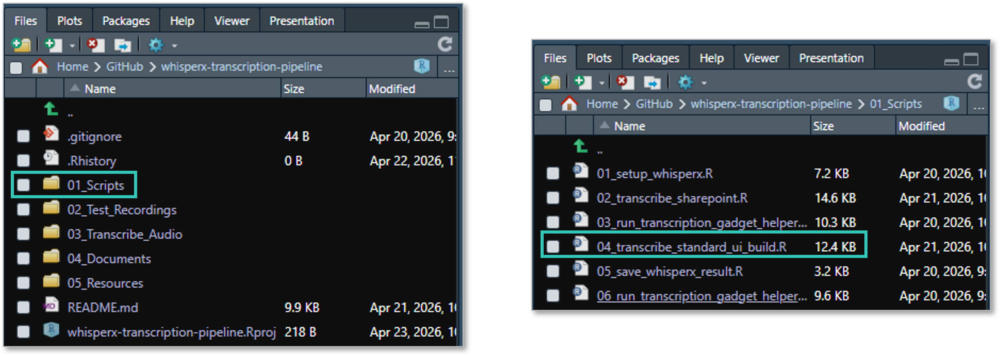

---

<br>

## Troubleshooting

**Error: "PackageNotFoundError"**
- Check internet connection
- Try: `conda_install("whisperx", packages = "whisperx", pip = TRUE, forge = TRUE)`

**Error: "CondaHTTPError"**
- Firewall blocking conda repositories
- Contact IT to whitelist `conda.anaconda.org`

**Error: "ConnectionError" / retrying to connect to huggingface.co**
- You are in offline mode (`local_run <- TRUE`) but models are not cached
- Run `setup_whisperx.R` with internet connected first, then switch to offline mode

**Error: "AudioDecoder is not defined"**
- Do not downgrade `pyannote.audio` — the script uses `Pipeline.from_pretrained()` directly which is compatible with pyannote 4.x

**Error: sprintf argument mismatch / SyntaxError in transcribe_audio.R**
- A path or variable has landed in the wrong position in the Python string
- Do not modify the sprintf arguments line without carefully counting every `%s` placeholder in the Python string

**Error: "WinError 1314 - A required privilege is not held by the client"**  
- Windows is blocking Hugging Face from creating symlinks in the model cache, which requires elevated privileges  
- Enable Developer Mode: Settings → System → Advanced → Developer Mode → toggle on  
- Restart RStudio and rerun `01_setup.whisperx.R`  

**Error: "RuntimeError: Failed to load audio — No such file or directory"**
- The file path defined in the control panel does not match the actual file or folder names on disk — check for typos, hyphens vs underscores, and incorrect folder names
- Verify R can see the audio file:
```r
  file.exists(audio_file)
```
- If it returns `FALSE`, check the exact folder and file names on disk:
```r
  list.files(here::here("your", "folder", "path"), recursive = TRUE)
```
- Correct any mismatches in the `audio_file` and `output_dir` definitions in the 
control panel and rerun

**Error: "FileNotFoundError — No such file or directory" when saving output**
- This can occur when the audio filename is excessively long or contains a complex combination of spaces, dots, and hyphens
- `os.path.join()` can mishandle these filenames on Windows, switching to backslash path separators which breaks the save step
- The transcription will complete successfully but fail at the save step
- Fix: rename the audio file to something shorter and simpler before running the script — e.g. `01_Baseline.MP3` instead of `1. Audio - Call with Additional Person on Line MARSHALL to Engie.MP3`
- If the transcription has already completed and the result is in your R environment, use `save_whisperx_result.R` to save without re-transcribing

**Transcription completes but output files fail to save**

- Don't panic — the transcription result is still available in your R environment
- Open 05_save_whisperx_result.R and run it — this will save the transcription directly to your output directory without re-transcribing

**Warning: "Xet Storage is enabled for this repo, but the 'hf_xet' package is not installed"**  
- This is a performance warning only — the pipeline will still work correctly without it  
- hf_xet is an optional package that enables faster model downloads from Hugging Face  
- To install it, run the following in your R console:
```r
reticulate::py_install("hf_xet", envname = "whisperx", pip = TRUE)
```
- Once installed the warning will no longer appear and model downloads will be faster
---

<br>