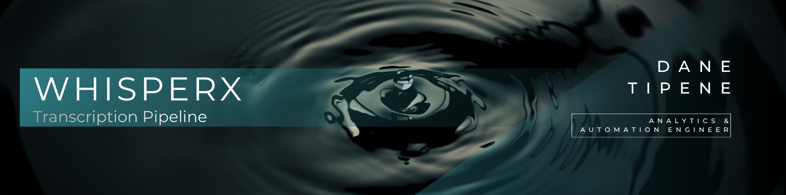

<br>

## Overview

An enforcement team had 3,478 call recordings across 300 customers to work through for an active investigation. They needed transcripts — fast — so investigators could filter and prioritise which calls to pursue.

Their existing tool was Word's built-in speech-to-text. It wasn't built for batch processing, produced unreliable output, and couldn't reliably identify who was speaking. A commercial transcription tool was the obvious answer, but procurement takes time, and the organisation's GenAI policy was still catching up with the technology. Neither path was going to move fast enough — and any solution had to operate within existing IT and GenAI policy boundaries. 

**I tested and evaluated options, then built and deployed a pipeline in-house that met every requirement:**

- Batch processes thousands of audio files automatically — no manual intervention required
- Identifies and labels individual speakers in each recording
- Runs entirely on local hardware — no audio ever leaves the team's infrastructure
- Produces transcripts in multiple formats ready for investigator review
- Logs every processed file so nothing is transcribed twice

**The result**: 3,478 calls across 300 customers transcribed — reliably, at scale, with strict privacy maintained throughout. Investigators got speaker-labelled transcripts in the format they needed to filter and prioritise calls efficiently. A final consolidated report, built from a verified master log across all analysts, was delivered to the enforcement team on completion.

<br>

### Table of Contents

- [The Workplace Build — Scripts 01–03](#the-workplace-build--scripts-0103)
- [Use It Yourself — Scripts 04–06](#use-it-yourself--scripts-0406)
- [GPU Build](#gpu-build)
- [A Real Use Case](#a-real-use-case)
- [Repo Structure](#repo-structure)

---

<br>

## The Workplace Build — Scripts 01–03

This is the pipeline as it was built and deployed. The structure, logic, and design decisions are preserved exactly — identifiers have been sanitised for this public version.

### What It Does

The pipeline runs in three scripts:

**`01_setup_whisperx.R`** — one-click environment setup. Installs Reticulate, Miniconda, creates the WhisperX conda environment, installs all dependencies, prompts for a Hugging Face token, and downloads and caches all required AI models locally. Run once per machine.

**`02_transcribe_sharepoint.R`** — the main transcription engine. Connects to a SharePoint site, recursively discovers all unprocessed audio files within an analyst's designated folder, transcribes each file through a four-stage WhisperX pipeline (load → transcribe → align timestamps → identify speakers), uploads outputs back to SharePoint, and logs every processed file to prevent duplicate runs.

**`03_run_transcription_gadget_helper.R`** — a Shiny gadget that opens a browser-based control panel before each run. Analysts select their name, enter their Hugging Face token, and confirm settings before the pipeline executes.

### The Design Decisions

**Distributed compute across team hardware**

Running 3,478 calls averaging five minutes each on a single CPU-only corporate machine would have taken approximately 66 days of overnight processing. By distributing the workload across six analyst machines and running the pipeline continuously wherever possible, all 3,478 calls were completed in 7 days with no significant impact on day-to-day computer use. The pipeline was hardened with additional defensive programming to handle edge cases and ensure stability across extended unattended runs.

**Privacy-by-design — analysts never see a single file**

Each analyst is pre-assigned a dedicated SharePoint folder by the pipeline owner. Their only interaction with the system is selecting their name from a dropdown in the control panel. The pipeline does the rest — silently discovering all audio files within their assigned folder, transcribing each one, and uploading outputs alongside the source file. No analyst ever sees a file list, navigates a folder, or knows what is in their queue.

The dropdown is not a convenience feature. It is a deliberate privacy control: analysts are routed only to their own files, with no visibility into anyone else's assignment.

**Offline mode — sensitive audio never touches a cloud server**

WhisperX and all AI models run entirely on local hardware. After the one-time setup downloads and caches the models, the pipeline operates fully offline. Sensitive call recordings are never transmitted to any external service.

**Completion logging — no file is transcribed twice**

Every processed file is logged to a local CSV on completion. On any subsequent run, the pipeline filters out already-processed files before beginning — meaning an analyst can run the script repeatedly over multiple days without risk of duplicating work.

### Post-Processing & Delivery

Once transcription was complete across all analysts, two additional scripts handled consolidation and verification.

**Transcript consolidation — per customer**

A post-processing script connected to SharePoint, recursively traversed all 300 customer folders, and combined each customer's individual transcripts into a single structured Word document — automatically uploaded back to the customer's folder on completion.

Each document followed a consistent structure:
- Customer file name and date transcribed
- Per recording: audio file name and the full transcript formatted as `SPEAKER | START TIME | END TIME | TEXT`
- All recordings for that customer in sequence

**The result**: investigators received one clean, structured document in their preferred format per customer rather than dozens of individual transcript files to manage manually.

**Master log & verification**

Each analyst's `processed_files_log.csv` was collected and combined into a master log. The script checked for duplicates, removed test recordings run before the production run began, and produced a final verified count of all transcribed files — confirming every call had been processed exactly once.

Outputs fed into a final analytical report delivered to the enforcement team.

### Stack

| Component | Role |
|---|---|
| R + Reticulate | Orchestration layer — R calls Python via the Reticulate bridge |
| Miniconda | Isolated Python environment management |
| WhisperX | Core transcription engine (built on OpenAI Whisper) |
| Faster-Whisper | Optimised speech-to-text backend inside WhisperX |
| Pyannote (×3 models) | Speaker diarisation — identifies and labels individual speakers |
| Microsoft365R | SharePoint connection for file discovery and upload |
| Shiny + miniUI | Browser-based control panel gadget |
| FFmpeg | Audio file processing and format handling |

---

<br>

## Use It Yourself — Scripts 04–06

Scripts 04–06 are a self-contained, portable version of the pipeline built for anyone who wants to transcribe their own audio files. No SharePoint required. Drop your audio files into the repo folder, run the script, get transcripts.

### What's Different

| | Workplace Build (01–03) | Standard Build (04–06) |
|---|---|---|
| Audio source | SharePoint | Local project folder |
| Analyst routing | Dropdown → assigned SharePoint folder | Direct file or folder path |
| Output destination | SharePoint `Completed` subfolder | Local `Completed` subfolder |
| Privacy controls | Multi-analyst, zero file visibility | Single user |
| Connection required | Yes (SharePoint auth) | No — fully offline after setup |

### How to Run

1. Complete the one-time setup using `01_setup_whisperx.R` if you haven't already
2. Place your audio files anywhere inside the project folder
3. Open `04_transcribe_standard_ui_build.R` and press `Ctrl + Shift + Enter`
4. A browser control panel opens — enter your audio file or folder path, configure settings, and click **Confirm & Run**
5. Transcription outputs are saved to a `Completed` subfolder alongside your audio files

Supported formats: `.mp4`, `.flac`, `.mp3`, `.wav`, `.m4a`

A test recording is included in `02_Audio/JFK_Test/` so you can verify your setup is working immediately after cloning.

**`05_save_whisperx_result.R`** is an emergency save script. If the pipeline completes transcription but fails at the save step, run this script to recover the result from your R environment without re-transcribing.

📄 **[Full setup and usage guide →](04_Documents/Standard_Build_Guide.md)**

---

<br>

## GPU Build

A GPU-accelerated version of this pipeline is available for machines with a compatible NVIDIA graphics card.

Performance comparison on an NVIDIA RTX 3060:

| Mode | Speed vs Real-Time |
|---|---|
| CPU (standard build) | ~1.75× slower than real-time |
| GPU (accelerated build) | ~5.8× faster than real-time |
| **Improvement** | **~10.4× faster than CPU** |

For context: a one-hour recording that takes approximately 1 hour 45 minutes on CPU completes in around 10 minutes on GPU.

📄 **[GPU setup guide →](04_Documents/GPU_Build_Guide.md)**

---

<br>

## A Real Use Case

I attended a Google Agentic AI seminar and wanted to make sure I actually retained what I learned — not just in the moment, but over time. Here's the workflow I used:

1. **Recorded** the seminar audio on my phone
2. **Transcribed** the recording using this pipeline — speaker-labelled, timestamped, ready to work with
3. **Summarised** the transcript using Claude, grouping key topics and insights by speaker
4. **Created** a NotebookLM podcast and video presentation from the summary for ongoing review

The result was a structured, searchable record of the seminar that I could revisit repeatedly — far more useful than notes taken in the moment or a raw audio file sitting on my phone.

This is the kind of workflow this pipeline enables beyond the workplace: any recorded conversation, interview, meeting, or event becomes a structured, reviewable knowledge asset with minimal effort.

📄 **[Event Intelligence Workflow →](04_Documents/Event_Intelligence_Workflow.md)**

---

<br>

## Repo Structure

```
whisperx-transcription-pipeline/
├── 01_Scripts/
│   ├── 01_setup_whisperx.R                            # One-time environment setup
│   ├── 02_transcribe_sharepoint.R                     # Workplace build — SharePoint transcription
│   ├── 03_run_transcription_gadget_helper.R           # Gadget helper — workplace build
│   ├── 04_transcribe_standard_ui_build.R              # Standard build — local transcription
│   ├── 05_save_whisperx_result.R                      # Emergency result recovery
│   ├── 06_run_transcription_gadget_helper_standard.R  # Gadget helper — standard build
│   ├── 07_setup_whisperx_gpu.R                        # GPU build — one-time environment setup
│   ├── 08_transcribe_audio_gpu.R                      # GPU build — transcription engine
│   ├── 09_transcribe_gpu.py                           # GPU build — Python transcription script
│   ├── 10_consolidate_transcripts.R                   # Post-processing — combine transcripts per customer, upload to SharePoint
│   └── 11_master_log.R                                # Post-processing — combine analyst logs, deduplicate, verify final count
├── 02_Audio/
│   ├── JFK_Test/                                      # 11 second test recording for setup verification
|   └── Our_Common_Bond_Test/                          # 4:34 min test two person recording
├── 03_Transcribe_Audio/                               # Folder to store local recordings and transcriptions
|   ├── processed_files_log.csv                        # Completion log — workplace build
|   └── processed_files_log_standard.csv               # Completion log — standard build
├── 04_Documents/                                      # Setup guides and SOP
└── 05_Resources/                                      # Images and repo assets
```

---

<br>

*Built by [Dane Tipene](https://github.com/DataDaneHQ) · Analytics & Automation Engineer*
